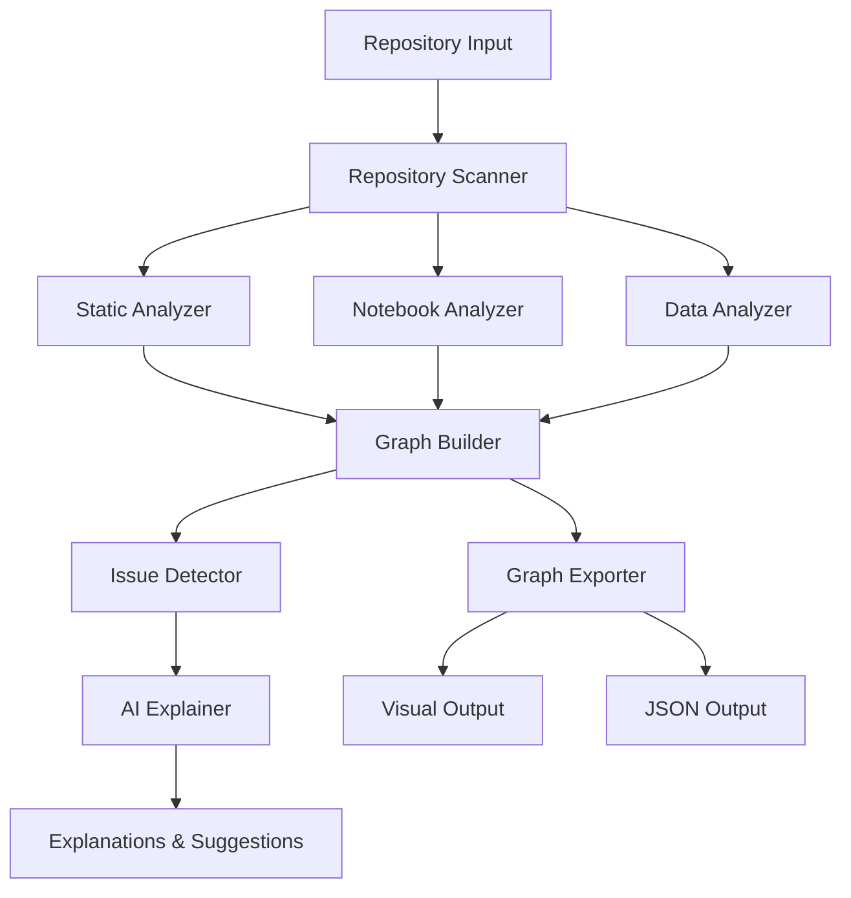

# Design Document: Repository Analyzer

## Overview

The AI-assisted repository understanding system is built as a modular analysis pipeline that combines deterministic static analysis with AI-powered explanations. The system follows a clear separation of concerns: deterministic analysis extracts facts and builds dependency graphs, while AI components provide human-readable explanations and suggestions based on those facts.

The architecture emphasizes explainability and confidence tracking, ensuring users can distinguish between detected facts and AI interpretations. The system is designed for hackathon-scale projects (typically <50 Python files) with efficient processing of code, notebooks, and data files.

## Architecture

The system follows a layered architecture with clear data flow:



### Core Components

1. **Repository Scanner**: Entry point that handles local folders and GitHub URLs
2. **Analysis Engines**: Specialized analyzers for different file types
3. **Graph Builder**: Constructs the unified dependency graph
4. **Issue Detector**: Identifies problems and anomalies
5. **Export System**: Generates visual and machine-readable outputs
6. **AI Explainer**: Provides human-readable insights

## Components and Interfaces

### Repository Scanner

**Responsibilities:**
- Validate and access repository sources (local/GitHub)
- Discover and categorize files by type
- Provide file content access to analyzers

**Key Methods:**
```python
class RepositoryScanner:
    def scan_repository(self, source: str) -> RepositoryStructure
    def validate_source(self, source: str) -> bool
    def discover_files(self, path: str) -> FileInventory
    def get_file_content(self, file_path: str) -> str
```

### Static Analyzer

**Responsibilities:**
- Parse Python files using AST
- Extract function/class definitions and signatures
- Identify imports and function calls
- Track confidence scores for each detection

**Key Methods:**
```python
class StaticAnalyzer:
    def analyze_python_file(self, file_path: str) -> FileAnalysis
    def extract_functions(self, ast_node) -> List[FunctionDef]
    def extract_imports(self, ast_node) -> List[ImportStatement]
    def extract_calls(self, ast_node) -> List[FunctionCall]
```

### Notebook Analyzer

**Responsibilities:**
- Parse Jupyter notebook JSON structure
- Extract and analyze code cells as Python
- Process markdown cells as documentation nodes
- Maintain cell execution order

**Key Methods:**
```python
class NotebookAnalyzer:
    def analyze_notebook(self, notebook_path: str) -> NotebookAnalysis
    def extract_code_cells(self, notebook_json) -> List[CodeCell]
    def extract_markdown_cells(self, notebook_json) -> List[MarkdownCell]
    def link_cells(self, cells: List[Cell]) -> List[CellRelationship]
```

### Data Analyzer

**Responsibilities:**
- Detect data file operations (read/write/append)
- Extract column usage patterns from pandas operations
- Perform heuristic analysis for dynamic file paths
- Track data lineage with confidence scores

**Key Methods:**
```python
class DataAnalyzer:
    def analyze_data_operations(self, ast_node) -> List[DataOperation]
    def extract_column_usage(self, ast_node) -> List[ColumnUsage]
    def infer_file_paths(self, operation: DataOperation) -> List[str]
    def calculate_confidence(self, operation: DataOperation) -> float
```

### Graph Builder

**Responsibilities:**
- Aggregate analysis results into unified graph
- Create nodes for all assets (files, functions, data)
- Generate labeled edges with confidence scores
- Maintain graph consistency and validation

**Key Methods:**
```python
class GraphBuilder:
    def build_graph(self, analyses: List[Analysis]) -> DependencyGraph
    def create_nodes(self, analyses: List[Analysis]) -> List[GraphNode]
    def create_edges(self, analyses: List[Analysis]) -> List[GraphEdge]
    def validate_graph(self, graph: DependencyGraph) -> ValidationResult
```

### Issue Detector

**Responsibilities:**
- Analyze graph for structural problems
- Detect dead code, dead data, and unused components
- Identify circular dependencies and logical anomalies
- Generate issue reports with severity levels

**Key Methods:**
```python
class IssueDetector:
    def detect_issues(self, graph: DependencyGraph) -> List[Issue]
    def find_dead_code(self, graph: DependencyGraph) -> List[DeadCodeIssue]
    def find_dead_data(self, graph: DependencyGraph) -> List[DeadDataIssue]
    def find_circular_dependencies(self, graph: DependencyGraph) -> List[CircularDependency]
```

### AI Explainer

**Responsibilities:**
- Generate human-readable explanations from graph summaries
- Create repository narratives and improvement suggestions
- Operate only on abstracted data, never raw code
- Maintain clear separation between facts and interpretations

**Key Methods:**
```python
class AIExplainer:
    def explain_graph(self, graph_summary: GraphSummary) -> str
    def generate_narrative(self, graph_summary: GraphSummary) -> str
    def suggest_improvements(self, issues: List[Issue]) -> List[Suggestion]
    def explain_relationships(self, relationships: List[GraphEdge]) -> str
```

## Data Models

### Core Graph Structures

```python
@dataclass
class GraphNode:
    id: str
    type: NodeType  # FILE, FUNCTION, CLASS, DATA, MARKDOWN
    name: str
    file_path: str
    metadata: Dict[str, Any]
    
@dataclass
class GraphEdge:
    source_id: str
    target_id: str
    relationship_type: RelationshipType  # CALLS, IMPORTS, READS, WRITES, APPENDS
    label: str
    confidence_score: float
    metadata: Dict[str, Any]

@dataclass
class DependencyGraph:
    nodes: List[GraphNode]
    edges: List[GraphEdge]
    metadata: GraphMetadata
```

### Analysis Results

```python
@dataclass
class FunctionDef:
    name: str
    signature: str
    line_number: int
    file_path: str
    docstring: Optional[str]

@dataclass
class DataOperation:
    operation_type: OperationType  # READ, WRITE, APPEND
    file_path: str
    columns: List[str]
    confidence_score: float
    line_number: int
    
@dataclass
class Issue:
    type: IssueType
    severity: Severity
    description: str
    affected_nodes: List[str]
    suggestions: List[str]
```

### Configuration and Output

```python
@dataclass
class AnalysisConfig:
    max_files: int = 50
    confidence_threshold: float = 0.5
    file_types: List[str] = ['.py', '.ipynb', '.csv', '.xlsx']
    enable_heuristics: bool = True
    
@dataclass
class ExportFormat:
    visual_formats: List[str] = ['png', 'svg']
    include_json: bool = True
    include_metadata: bool = True
```

## Correctness Properties

*A property is a characteristic or behavior that should hold true across all valid executions of a system—essentially, a formal statement about what the system should do. Properties serve as the bridge between human-readable specifications and machine-verifiable correctness guarantees.*

### Repository Scanning Properties

**Property 1: File Discovery Completeness**
*For any* repository structure, when scanning is performed, all Python files (.py), Jupyter notebooks (.ipynb), data files (.csv, .xls, .xlsx), and text files (.txt) should be discovered and categorized correctly
**Validates: Requirements 1.3**

**Property 2: Path Validation Consistency**
*For any* local folder path, validation should correctly identify whether the path exists and contains Python files
**Validates: Requirements 1.1**

**Property 3: GitHub URL Processing**
*For any* valid GitHub URL, the repository should be successfully cloned to a temporary location and made accessible for analysis
**Validates: Requirements 1.2**

**Property 4: Error Message Clarity**
*For any* repository access failure, the error message should clearly indicate the specific failure reason and be actionable
**Validates: Requirements 1.5**

### Static Analysis Properties

**Property 5: Python Code Extraction Completeness**
*For any* valid Python file, all function definitions, class definitions, import statements, and function calls should be extracted with their complete signatures and locations
**Validates: Requirements 2.1, 2.2, 2.3, 2.4**

**Property 6: Syntax Error Resilience**
*For any* Python file with syntax errors, the analyzer should log the error and continue processing other files without terminating
**Validates: Requirements 2.5**

### Notebook Analysis Properties

**Property 7: Notebook Cell Extraction**
*For any* valid Jupyter notebook, all code cells should be extracted and analyzed as Python code, and all markdown cells should be extracted as documentation nodes
**Validates: Requirements 3.1, 3.2**

**Property 8: Cell Relationship Preservation**
*For any* Jupyter notebook, markdown cells should be correctly linked to adjacent code cells, and cell execution order should be preserved
**Validates: Requirements 3.3, 3.4**

### Data Analysis Properties

**Property 9: Data Operation Detection**
*For any* Python code containing pandas or data file operations, all read, write, and append operations should be detected and correctly classified
**Validates: Requirements 4.1, 4.2**

**Property 10: Column Usage Tracking**
*For any* pandas operations in Python code, column names and usage patterns should be extracted and tracked with appropriate confidence scores
**Validates: Requirements 4.3, 4.4**

**Property 11: Dynamic Path Inference**
*For any* data operations with dynamic file paths, heuristic analysis should provide reasonable path inferences with appropriate confidence scores
**Validates: Requirements 4.5**

### Graph Construction Properties

**Property 12: Node Creation Completeness**
*For any* completed analysis, nodes should be created for all discovered assets (files, functions, classes, notebooks, markdown blocks, and data assets)
**Validates: Requirements 5.1**

**Property 13: Edge Creation and Labeling**
*For any* relationships detected during analysis, labeled edges should be created with appropriate relationship types, confidence scores, and preserved metadata
**Validates: Requirements 5.2, 5.4, 5.5**

**Property 14: Visual Distinction Consistency**
*For any* graph visualization, different colors should consistently distinguish read vs write vs append operations
**Validates: Requirements 5.3**

### Issue Detection Properties

**Property 15: Dead Code Detection**
*For any* dependency graph, functions, classes, and files that are never called or imported should be correctly identified as dead code
**Validates: Requirements 6.1, 6.3**

**Property 16: Dead Data Detection**
*For any* dependency graph with data operations, files that are written but never read should be correctly identified as dead data
**Validates: Requirements 6.2**

**Property 17: Column Usage Analysis**
*For any* dependency graph with column operations, columns that are never used should be correctly identified
**Validates: Requirements 6.4**

**Property 18: Dependency Anomaly Detection**
*For any* dependency graph, circular dependencies and logical anomalies (data written but never read, columns read but never written) should be correctly identified
**Validates: Requirements 6.5, 6.6**

**Property 19: Isolated Component Detection**
*For any* dependency graph, notebooks and components with no impact on other components should be correctly identified
**Validates: Requirements 6.7**

### Export and Visualization Properties

**Property 20: Multi-format Export Completeness**
*For any* dependency graph, export should generate both visual formats (PNG, SVG) and machine-readable JSON with all required metadata
**Validates: Requirements 7.1, 7.2, 7.5**

**Property 21: Visual Representation Consistency**
*For any* graph visualization, different node shapes should be used for different asset types, and color coding should be consistent for relationship types
**Validates: Requirements 7.3, 7.4**

### AI Explanation Properties

**Property 22: Explanation Generation Quality**
*For any* graph summary provided to AI components, plain English descriptions and human-readable narratives should be generated that accurately reflect the graph relationships
**Validates: Requirements 8.1, 8.2**

**Property 23: Improvement Suggestion Relevance**
*For any* detected issues, AI-generated suggestions should be specific, actionable, and relevant to the identified problems
**Validates: Requirements 8.3**

**Property 24: AI Input Restriction**
*For any* AI explanation request, the AI components should operate only on graph summaries and small code snippets, never on raw repository content
**Validates: Requirements 8.4**

**Property 25: Fact-Interpretation Separation**
*For any* AI-generated explanation, detected facts should be clearly separated from AI interpretations in the output
**Validates: Requirements 8.5**

### Configuration and Performance Properties

**Property 26: Configuration Parameter Handling**
*For any* analysis configuration, all specified parameters for depth, scope, thresholds, and filters should be correctly applied during analysis
**Validates: Requirements 9.1, 9.2, 9.3, 9.4**

**Property 27: Configuration Error Handling**
*For any* invalid configuration, clear error messages should be provided and appropriate default values should be used
**Validates: Requirements 9.5**

**Property 28: Resource Management**
*For any* large data files or memory-constrained environments, appropriate sampling techniques and graceful degradation should be applied to prevent system failure
**Validates: Requirements 10.2, 10.4**

**Property 29: Progress Reporting**
*For any* running analysis, progress indicators and status updates should be provided throughout the process
**Validates: Requirements 10.3**

**Property 30: Resource Constraint Error Handling**
*For any* analysis failure due to resource constraints, clear error messages with suggested solutions should be provided
**Validates: Requirements 10.5**

## Error Handling

The system implements comprehensive error handling at multiple levels:

### Input Validation Errors
- Invalid repository paths or URLs
- Malformed configuration parameters
- Unsupported file formats

**Strategy**: Validate inputs early, provide clear error messages, and fail fast with actionable feedback.

### Analysis Errors
- Python syntax errors in source files
- Corrupted Jupyter notebooks
- Inaccessible data files

**Strategy**: Log errors with context, continue processing other files, and include error information in final reports.

### Resource Constraint Errors
- Memory exhaustion during large file processing
- Timeout during complex analysis
- Disk space limitations

**Strategy**: Implement graceful degradation, use sampling techniques, and provide clear resource requirement guidance.

### AI Service Errors
- API failures during explanation generation
- Rate limiting or quota exceeded
- Invalid responses from AI services

**Strategy**: Implement retry logic, provide fallback explanations, and clearly indicate when AI features are unavailable.

## Testing Strategy

The repository analyzer requires a dual testing approach combining unit tests for specific scenarios and property-based tests for comprehensive coverage.

### Unit Testing Focus
- **Specific Examples**: Test known code patterns and expected outputs
- **Edge Cases**: Handle empty repositories, single-file projects, and malformed inputs
- **Integration Points**: Verify component interactions and data flow
- **Error Conditions**: Validate error handling and recovery mechanisms

### Property-Based Testing Focus
- **Universal Properties**: Verify correctness properties across all valid inputs
- **Comprehensive Coverage**: Test with randomly generated repositories, code structures, and configurations
- **Confidence Validation**: Ensure confidence scores accurately reflect detection certainty
- **Graph Consistency**: Validate graph structure and relationship integrity

### Testing Configuration
- **Property Test Library**: Use Hypothesis for Python property-based testing
- **Minimum Iterations**: Configure each property test to run 100+ iterations
- **Test Tagging**: Each property test must reference its design document property
- **Tag Format**: `# Feature: repository-analyzer, Property {number}: {property_text}`

### Test Data Generation
- **Synthetic Repositories**: Generate repositories with known structures for validation
- **Code Pattern Libraries**: Create libraries of common Python patterns for testing
- **Notebook Templates**: Generate Jupyter notebooks with various cell arrangements
- **Data File Samples**: Create CSV/Excel files with known column structures

The testing strategy ensures both concrete correctness (unit tests) and universal correctness (property tests), providing confidence in the system's reliability across diverse repository structures.